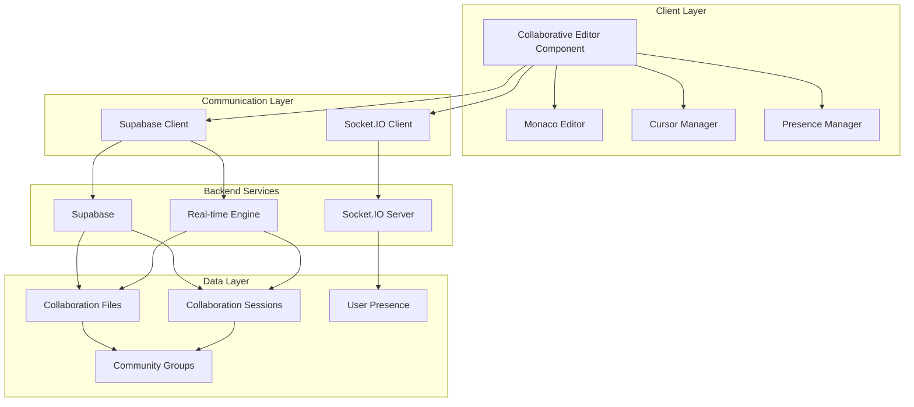

# Design Document

## Overview

The collaborative editor system will extend the existing community group functionality to provide real-time collaborative code editing capabilities. The system leverages Monaco Editor (already in dependencies) for the core editing experience, Supabase for real-time synchronization and persistence, and Socket.IO for low-latency cursor and presence updates.

The architecture follows a hybrid approach where file content changes are handled through Supabase real-time subscriptions for reliability and persistence, while cursor movements and user presence are managed through Socket.IO for optimal performance.

## Architecture

### High-Level Architecture



### Component Architecture

The collaborative editor will be implemented as a modular system with the following key components:

1. **CollaborativeEditor**: Main container component that orchestrates all collaboration features
2. **MonacoEditorWrapper**: Enhanced Monaco Editor with collaboration hooks
3. **CursorManager**: Handles real-time cursor tracking and display
4. **PresenceManager**: Manages user presence and activity status
5. **FileManager**: Handles file operations and synchronization
6. **ConflictResolver**: Manages operational transformation for concurrent edits

## Components and Interfaces

### Core Components

#### CollaborativeEditor Component
```typescript
interface CollaborativeEditorProps {
  groupId: string;
  initialFileId?: string;
  userId: string;
  userName: string;
  onFileChange?: (fileId: string) => void;
  onUserJoin?: (user: CollaborationUser) => void;
  onUserLeave?: (userId: string) => void;
}

interface CollaborativeEditorState {
  currentFile: CollaborationFile | null;
  activeUsers: CollaborationUser[];
  isConnected: boolean;
  connectionStatus: 'connecting' | 'connected' | 'disconnected' | 'reconnecting';
  pendingChanges: EditorChange[];
}
```

#### CursorManager
```typescript
interface CursorPosition {
  line: number;
  column: number;
  userId: string;
  userName: string;
  color: string;
  timestamp: number;
}

interface TextSelection {
  startLine: number;
  startColumn: number;
  endLine: number;
  endColumn: number;
  userId: string;
  userName: string;
  color: string;
}

interface CursorManagerInterface {
  updateCursor(position: CursorPosition): void;
  updateSelection(selection: TextSelection): void;
  removeCursor(userId: string): void;
  getCursors(): CursorPosition[];
  getSelections(): TextSelection[];
}
```

#### PresenceManager
```typescript
interface CollaborationUser {
  id: string;
  name: string;
  email?: string;
  avatar?: string;
  status: 'online' | 'away' | 'offline';
  currentFile?: string;
  lastActivity: Date;
  cursorColor: string;
}

interface PresenceManagerInterface {
  joinSession(groupId: string, user: CollaborationUser): Promise<void>;
  leaveSession(): Promise<void>;
  updateActivity(): void;
  updateCurrentFile(fileId: string): void;
  getActiveUsers(): CollaborationUser[];
  subscribeToPresence(callback: (users: CollaborationUser[]) => void): void;
}
```

### Real-time Communication Interfaces

#### Socket.IO Events
```typescript
// Client to Server Events
interface ClientToServerEvents {
  'join-collaboration': (data: { groupId: string; user: CollaborationUser }) => void;
  'leave-collaboration': (data: { groupId: string; userId: string }) => void;
  'cursor-update': (data: { groupId: string; fileId: string; cursor: CursorPosition }) => void;
  'selection-update': (data: { groupId: string; fileId: string; selection: TextSelection }) => void;
  'typing-start': (data: { groupId: string; fileId: string; userId: string }) => void;
  'typing-stop': (data: { groupId: string; fileId: string; userId: string }) => void;
  'file-switch': (data: { groupId: string; fileId: string; userId: string }) => void;
}

// Server to Client Events
interface ServerToClientEvents {
  'user-joined': (user: CollaborationUser) => void;
  'user-left': (userId: string) => void;
  'cursor-updated': (data: { fileId: string; cursor: CursorPosition }) => void;
  'selection-updated': (data: { fileId: string; selection: TextSelection }) => void;
  'user-typing': (data: { fileId: string; userId: string; isTyping: boolean }) => void;
  'file-switched': (data: { fileId: string; userId: string }) => void;
  'connection-status': (status: 'connected' | 'disconnected') => void;
}
```

## Data Models

### Database Schema Extensions

#### Collaboration Files Table
```sql
CREATE TABLE collaboration_files (
  id UUID PRIMARY KEY DEFAULT gen_random_uuid(),
  group_id UUID NOT NULL REFERENCES community_groups(id) ON DELETE CASCADE,
  name VARCHAR(255) NOT NULL,
  path VARCHAR(500) NOT NULL,
  content TEXT NOT NULL DEFAULT '',
  language VARCHAR(50) NOT NULL DEFAULT 'plaintext',
  created_by UUID NOT NULL REFERENCES auth.users(id),
  created_at TIMESTAMP WITH TIME ZONE DEFAULT now(),
  updated_at TIMESTAMP WITH TIME ZONE DEFAULT now(),
  version INTEGER NOT NULL DEFAULT 1,
  UNIQUE(group_id, path)
);
```

#### Collaboration Sessions Table
```sql
CREATE TABLE collaboration_sessions (
  id UUID PRIMARY KEY DEFAULT gen_random_uuid(),
  group_id UUID NOT NULL REFERENCES community_groups(id) ON DELETE CASCADE,
  user_id UUID NOT NULL REFERENCES auth.users(id) ON DELETE CASCADE,
  current_file_id UUID REFERENCES collaboration_files(id),
  status VARCHAR(20) NOT NULL DEFAULT 'online',
  last_activity TIMESTAMP WITH TIME ZONE DEFAULT now(),
  cursor_position JSONB,
  joined_at TIMESTAMP WITH TIME ZONE DEFAULT now(),
  UNIQUE(group_id, user_id)
);
```

#### File Changes Table (for operational transformation)
```sql
CREATE TABLE file_changes (
  id UUID PRIMARY KEY DEFAULT gen_random_uuid(),
  file_id UUID NOT NULL REFERENCES collaboration_files(id) ON DELETE CASCADE,
  user_id UUID NOT NULL REFERENCES auth.users(id),
  operation_type VARCHAR(20) NOT NULL, -- 'insert', 'delete', 'replace'
  position_start INTEGER NOT NULL,
  position_end INTEGER,
  content TEXT,
  version INTEGER NOT NULL,
  timestamp TIMESTAMP WITH TIME ZONE DEFAULT now(),
  applied BOOLEAN DEFAULT false
);
```

### TypeScript Data Models

#### File Models
```typescript
interface CollaborationFile {
  id: string;
  groupId: string;
  name: string;
  path: string;
  content: string;
  language: string;
  createdBy: string;
  createdAt: Date;
  updatedAt: Date;
  version: number;
}

interface FileChange {
  id: string;
  fileId: string;
  userId: string;
  operationType: 'insert' | 'delete' | 'replace';
  positionStart: number;
  positionEnd?: number;
  content?: string;
  version: number;
  timestamp: Date;
  applied: boolean;
}
```

#### Editor Models
```typescript
interface EditorChange {
  range: {
    startLineNumber: number;
    startColumn: number;
    endLineNumber: number;
    endColumn: number;
  };
  text: string;
  rangeLength: number;
  userId: string;
  timestamp: number;
  version: number;
}

interface OperationalTransform {
  transform(change1: EditorChange, change2: EditorChange): EditorChange[];
  apply(content: string, change: EditorChange): string;
  compose(changes: EditorChange[]): EditorChange;
}
```

## Error Handling

### Connection Management
- **Network Disconnection**: Implement exponential backoff reconnection strategy
- **Conflict Resolution**: Use operational transformation to resolve concurrent edits
- **Data Consistency**: Implement version control with conflict detection
- **Offline Mode**: Queue changes locally and sync when connection is restored

### Error Recovery Strategies
```typescript
interface ErrorRecoveryStrategy {
  handleConnectionLoss(): void;
  handleConflictResolution(conflicts: EditorChange[]): void;
  handleSyncFailure(pendingChanges: EditorChange[]): void;
  handleVersionMismatch(localVersion: number, serverVersion: number): void;
}
```

### Error Types and Handling
1. **Connection Errors**: Graceful degradation to offline mode
2. **Sync Conflicts**: Present merge interface to users
3. **Permission Errors**: Clear feedback and fallback to read-only mode
4. **File Access Errors**: Retry mechanism with user notification
5. **Real-time Subscription Errors**: Automatic reconnection with state recovery

## Testing Strategy

### Unit Testing
- **Component Testing**: Test each collaboration component in isolation
- **Service Testing**: Test real-time communication services
- **Utility Testing**: Test operational transformation algorithms
- **State Management**: Test collaboration state management

### Integration Testing
- **Real-time Communication**: Test Socket.IO and Supabase integration
- **Conflict Resolution**: Test concurrent editing scenarios
- **File Operations**: Test file CRUD operations with collaboration
- **User Presence**: Test presence management across multiple users

### End-to-End Testing
- **Multi-user Scenarios**: Test collaboration with multiple simultaneous users
- **Network Conditions**: Test behavior under various network conditions
- **File Management**: Test file switching and management workflows
- **Error Recovery**: Test recovery from various error conditions

### Performance Testing
- **Latency Testing**: Measure cursor update and text sync latency
- **Load Testing**: Test with multiple concurrent collaboration sessions
- **Memory Usage**: Monitor memory usage with large files and many users
- **Network Efficiency**: Measure bandwidth usage for real-time features

## Implementation Phases

### Phase 1: Core Editor Integration
- Set up Monaco Editor with basic collaboration hooks
- Implement file loading and saving to Supabase
- Create basic UI components for file management

### Phase 2: Real-time Communication
- Implement Socket.IO integration for cursor tracking
- Add user presence management
- Create basic conflict resolution

### Phase 3: Advanced Collaboration Features
- Implement operational transformation
- Add multi-file support
- Create advanced conflict resolution UI

### Phase 4: Polish and Optimization
- Add offline support
- Implement performance optimizations
- Add comprehensive error handling and recovery