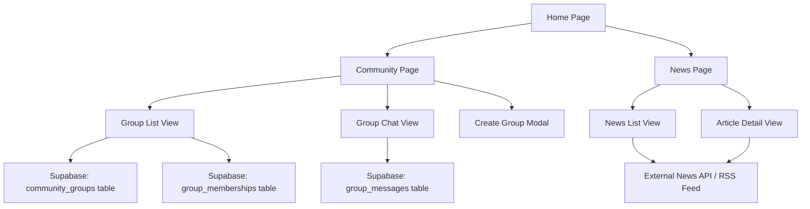

# Design Document

## Overview

This design implements two new pages for the existing React/TypeScript application: a Community page with group management and real-time chat functionality, and a News page displaying technical news and updates. The solution leverages the existing Supabase backend, React Router for navigation, and the established UI component library (Radix UI + shadcn/ui).

## Architecture

### Technology Stack
- **Frontend**: React 18 with TypeScript
- **Routing**: React Router DOM v6
- **Backend**: Supabase (PostgreSQL database, real-time subscriptions, authentication)
- **UI Components**: Radix UI primitives with shadcn/ui styling
- **Styling**: Tailwind CSS
- **State Management**: React Query for server state, React hooks for local state
- **Real-time Communication**: Supabase real-time subscriptions

### High-Level Architecture



## Components and Interfaces

### Page Components

#### Community Page (`src/pages/Community.tsx`)
- Main container for community functionality
- Manages routing between group list and chat views
- Handles group creation modal state

#### News Page (`src/pages/News.tsx`)
- Displays news articles in a feed format
- Handles article selection and detail view
- Manages news data fetching and pagination

### Feature Components

#### CommunityGroupList (`src/components/CommunityGroupList.tsx`)
- Displays available community groups
- Shows group metadata (name, description, member count)
- Provides join/leave/delete actions
- Handles group creation trigger

#### GroupChat (`src/components/GroupChat.tsx`)
- Real-time chat interface for group members
- Message display with user attribution and timestamps
- Message input and sending functionality
- Real-time message updates via Supabase subscriptions

#### CreateGroupModal (`src/components/CreateGroupModal.tsx`)
- Form for creating new community groups
- Input validation for group name and description
- Integration with group creation API

#### NewsFeed (`src/components/NewsFeed.tsx`)
- Displays list of news articles
- Article preview cards with title, summary, date
- Pagination or infinite scroll for large datasets

#### NewsArticle (`src/components/NewsArticle.tsx`)
- Full article view component
- Displays complete article content
- Navigation back to news feed

### Utility Components

#### GroupMemberBadge (`src/components/GroupMemberBadge.tsx`)
- Shows member count and membership status
- Visual indicator for group ownership

## Data Models

### Database Schema (Supabase)

#### community_groups
```sql
CREATE TABLE community_groups (
  id UUID PRIMARY KEY DEFAULT gen_random_uuid(),
  name VARCHAR(100) NOT NULL UNIQUE,
  description TEXT,
  owner_id UUID REFERENCES auth.users(id) ON DELETE CASCADE,
  created_at TIMESTAMP WITH TIME ZONE DEFAULT NOW(),
  updated_at TIMESTAMP WITH TIME ZONE DEFAULT NOW()
);
```

#### group_memberships
```sql
CREATE TABLE group_memberships (
  id UUID PRIMARY KEY DEFAULT gen_random_uuid(),
  group_id UUID REFERENCES community_groups(id) ON DELETE CASCADE,
  user_id UUID REFERENCES auth.users(id) ON DELETE CASCADE,
  joined_at TIMESTAMP WITH TIME ZONE DEFAULT NOW(),
  UNIQUE(group_id, user_id)
);
```

#### group_messages
```sql
CREATE TABLE group_messages (
  id UUID PRIMARY KEY DEFAULT gen_random_uuid(),
  group_id UUID REFERENCES community_groups(id) ON DELETE CASCADE,
  user_id UUID REFERENCES auth.users(id) ON DELETE CASCADE,
  content TEXT NOT NULL,
  created_at TIMESTAMP WITH TIME ZONE DEFAULT NOW()
);
```

### TypeScript Interfaces

```typescript
interface CommunityGroup {
  id: string;
  name: string;
  description: string;
  owner_id: string;
  created_at: string;
  updated_at: string;
  member_count?: number;
  is_member?: boolean;
  is_owner?: boolean;
}

interface GroupMembership {
  id: string;
  group_id: string;
  user_id: string;
  joined_at: string;
}

interface GroupMessage {
  id: string;
  group_id: string;
  user_id: string;
  content: string;
  created_at: string;
  user_profile?: {
    username: string;
    display_name: string;
    avatar_url: string;
  };
}

interface NewsArticle {
  id: string;
  title: string;
  summary: string;
  content: string;
  author: string;
  published_at: string;
  source_url: string;
  category: 'tech' | 'software' | 'development' | 'industry';
}
```

## Error Handling

### Community Features
- **Group Creation Errors**: Handle duplicate names, validation failures, database constraints
- **Membership Errors**: Handle already joined/left states, permission issues
- **Chat Errors**: Handle message sending failures, connection issues
- **Real-time Errors**: Graceful degradation when subscriptions fail

### News Features
- **API Failures**: Fallback to cached content, retry mechanisms
- **Network Issues**: Offline indicators, cached article reading
- **Content Errors**: Handle malformed articles, missing data

### Error Display Strategy
- Use existing toast system (Sonner) for user feedback
- Inline error messages for form validation
- Loading states for async operations
- Graceful degradation for non-critical features

## Testing Strategy

### Unit Tests
- Component rendering and prop handling
- Utility functions for data transformation
- Form validation logic
- Message formatting and display

### Integration Tests
- Group creation and membership workflows
- Chat message sending and receiving
- News article fetching and display
- Navigation between views

### Real-time Testing
- Message delivery in group chats
- Membership updates across sessions
- Connection handling and reconnection

### Database Testing
- CRUD operations for all entities
- Constraint validation
- Real-time subscription functionality
- Data integrity and relationships

## Implementation Phases

### Phase 1: Database and Basic Structure
- Create Supabase database tables and relationships
- Set up Row Level Security (RLS) policies
- Create basic page components and routing
- Implement navigation from home page

### Phase 2: Community Groups Management
- Implement group creation, listing, and deletion
- Add join/leave functionality
- Create group membership management
- Add basic UI for group operations

### Phase 3: Real-time Chat
- Implement message sending and display
- Add real-time subscriptions for live updates
- Create chat UI with proper message formatting
- Handle user presence and typing indicators

### Phase 4: News Integration
- Set up news data source (API or RSS)
- Implement news fetching and caching
- Create news display components
- Add article detail views

### Phase 5: Polish and Optimization
- Add loading states and error handling
- Implement responsive design
- Add accessibility features
- Performance optimization for real-time features

## Security Considerations

### Authentication and Authorization
- Leverage existing Supabase auth system
- Implement RLS policies for data access control
- Ensure users can only access groups they're members of
- Protect group management actions (create, delete) appropriately

### Data Validation
- Server-side validation for all user inputs
- Sanitize chat messages to prevent XSS
- Validate group names and descriptions
- Rate limiting for message sending

### Privacy
- Ensure chat messages are only visible to group members
- Implement proper data deletion when users leave groups
- Handle user data according to privacy requirements